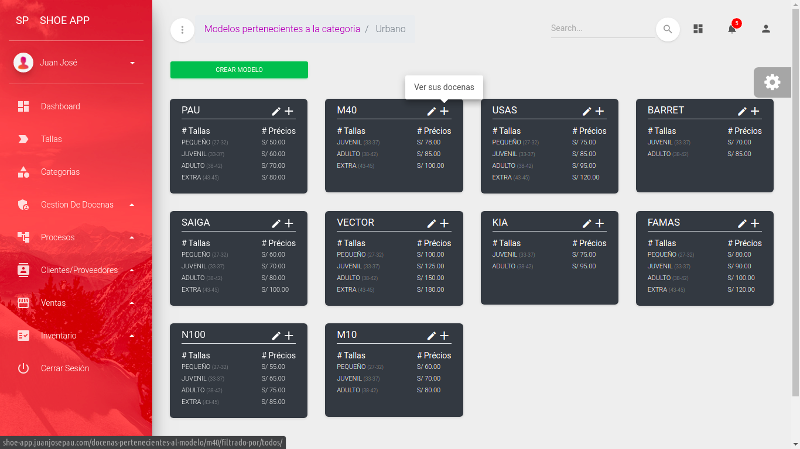

# [Aplicación de gestión de calzado](#)

>Ver Demo [Shoe App](http://shoe-app.juanjosepau.com "Ver demo")

### Este sistema esta creado para el manejo de inventario de materiales y el control del personal de la empresa de calzado Nik Fort.

 

### El sistema cumple con las siguientes funciones:
* Crear grupos de trabajadores.
* Registrar trabajadores y agregarlos a un grupo.
* Registrar categorias de zapatos (Urbano, Sport, Vans).
* Registrar modelos y asignarles una categoria.
* Manejo de inventario (registrando el ingreso y salida de material al almacén).
* Manejar el control de cada docena que se aga en la empresa como su historial y su venta.
* Etc...

## Captura de pantalla
>Página de modelos

